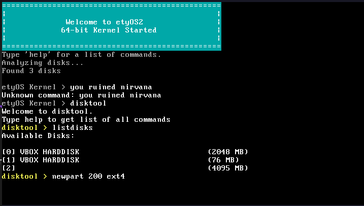

---

# etyOS



### Created by **Mikhail Karlov**

---

**etyOS** is a custom operating system built from scratch, aimed at providing a highly efficient and lightweight system kernel. The core design of etyOS focuses on low-level system control, including memory management, file systems, and process management.

## Features

- **Kernel**: Developed in C, the kernel includes essential modules such as memory allocation, file system handling, and partition management.
- **Bootloader**: Written in assembly (`x86_64/boot`), this ensures a fast and secure system start-up. The boot sequence involves low-level initializations handled in `header.asm`, `main.asm`, and `main64.asm`.
- **Filesystem Support**: Custom-built disk tools (`disktool.c`), filesystem handlers (`filesystem.c`), and partition management are included.
- **Memory Management**: Efficient memory allocation is managed through the `memory_allocator.c` module, ensuring optimized use of system resources.
- **Command-line Utilities**: Basic system commands and I/O operations are supported via the `commands/` folder, giving users terminal-based control over the OS.

## Project Structure

```plaintext
├── source
│   ├── implementation
│   │   ├── kernel
│   │   │   ├── commands
│   │   │   └── main.c
│   │   └── x86_64
│   │       └── boot
│   │           ├── header.asm
│   │           ├── main.asm
│   │           └── main64.asm
│   ├── interface
│       └── kernel
│           ├── console.h
│           └── filesystem.h
```

### Key Files:

- `kernel/main.c`: Core kernel functionality written in C.
- `x86_64/boot/`: Assembly code handling bootloader tasks.
- `memory_allocator.c`: Custom memory management system.

## Getting Started

Clone the repository and follow the instructions to build and run etyOS:

```bash
git clone https://github.com/karlovm/etyOS2.git
cd etyOS2
# Follow build instructions (coming soon)
```

## License

This project is licensed under the [MIT License](LICENSE).

---
